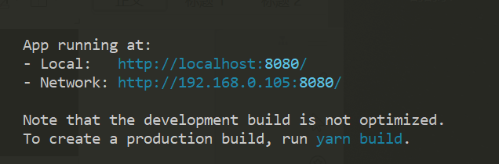

详见下文
<!--more-->

## VUE3新特性

### vue3项目的创建

#### 安装vue-cli脚手架构建工具

vue-cli 提供一个官方命令行工具，可用于快速搭建大型单页应用。

输入命令

```
cnpm install -g @vue/cli
```


查看版本，要求vue-cli版本在4.5以上，可以创建vue3项目


#### 创建vue3项目

vue create 项目名称


手动安装


#### 启动项目




###  createApp

在 Vue 3 中，改变全局 Vue 行为的 API 现在被移动到了由新的 `createApp` 方法所创建的应用实例上。

```
import { createApp } from 'vue'
const app = createApp({})
```

调用 `createApp` 返回一个应用实例。该实例提供了一个应用上下文。应用实例挂载的整个组件树共享相同的上下文，该上下文提供了之前在 Vue 2.x 中“全局”的配置。

另外，由于 `createApp` 方法返回应用实例本身，因此可以在其后链式调用其它方法

vue3.0中使用createApp 来创建vue实例

```
import { createApp } from 'vue'
import App from './App.vue'
const app = createApp(App);
app.mount('#app');
```

main.js 下加载router、vuex

```
import { createApp } from 'vue'
import App from './App.vue'
import router from './router'
import store from './store'

const app = createApp(App);
app.use(store)
app.use(router)
app.mount('#app');

合并之后的代码：
createApp(App).use(store).use(router).mount('#app')
```

### setup函数

#### 1、简介

setup函数是vue3中专门为组件提供的新属性。

#### 2、执行时机

创建组件实例，然后初始化props，紧接着就调用setup函数，会在beforeCreate钩子之前被调用。

#### 3、模板中使用

如果setup返回一个对象，则对象的属性将会被合并到组件模板的渲染上下文。

#### 4、如何使用

```
<template>
  <div>
      {{name}}
  </div>
</template>

<script>
import { reactive } from "vue"
export default {
	props:{
		item:String
	}
  //setup函数会在beforeCreate之后，created之前执行 setup相当于是预设配置
  //setup函数的第一个形参，接收props数据,通过props.item获取
  setup(props){
    //创建响应式数据对象
    const state = reactive({
      name:'abc'
    })
    //setup函数中将响应式数据对象return出去供template使用
    return state
  }
}
</script>
```

注意：在setup()函数中无法访问到this


### reactive函数

#### 1、简介

reactive()函数接收一个普通对象，返回一个响应式的数据对象

#### 2、基本语法

```
按需导入reactive函数
import { reactive} from "vue"

创建响应式数据对象
const state = reactive({ id:1 })
```

#### 3、定义响应式数据供template使用

```
1)按需导入reactive函数
import { reactive} from "vue"

2)在setup()函数中调用reactive()函数，创建响应式数据对象
setup(){
    //创建响应式数据对象
    const state = reactive({
      name:'abc'
    })
    //setup函数中将响应式数据对象return出去供template使用
    return state
}

3)在template中访问响应式数据
<template>
  <div>
      {{name}}
  </div>
</template>
```


### ref的使用

#### 1、简介

ref()函数用来根据给定的值创建一个响应式的数据对象，ref()函数调用的返回值是一个对象，这个对象上只包含一个value属性

#### 2、基本语法

```
1)按需导入ref函数
import { ref } from "vue"

2)在setup()函数中调用ref()函数，创建响应式数据对象
setup(){
    var c = ref(10);   //初始化值为10
    return {c}
}

3)在template中访问响应式数据
<template>
  <div>
      {{c}}
  </div>
</template>
```

#### 3、如何使用

```
<template>
  <div>
    <p>{{c}}</p>
    <button  @click="change()">click</button>
  </div>
</template>

<script>
import { ref } from "vue"

export default {
  setup(){
    var c = ref(10);   //初始化值为10
    const change=()=>{  //方法的定义
        c.value+=1;  //想改变值或获取值 必须.value
    }
    return {
      c,
      change
    };
  }
}
</script>
```

在reactive()函数中的使用

```
<template>
  <div>
    <p>{{a}}</p>
  </div>
</template>

<script>
import { ref,reactive,onMounted } from "vue"

export default {
  setup(){
    const state = reactive({
      a:ref(99)
    })
    onMounted(()=>{ //生命周期-挂载完成
      setInterval(function(){
        state.a +=10
      },1000)
    })
    return state;
  }
}
</script>
```

4、ref()和reactive的不同

reactive的用法与ref的用法相似，也是将数据变成响应式数据，当数据发生变化时UI也会自动更新。不同的是ref用于基本数据类型，而reactive是用于复杂数据类型

```
<template>
  <div>
    <p>{{d}}</p>
    <button  @click="change()">click</button>
  </div>
</template>
 
<script>
import { reactive } from "vue";
export default {
  setup() {
    let d = reactive(10);
    function change() {
      console.log(d);
      d+=1;  //页面不会同步渲染
    }
    return { d,change };
  },
};

</script>
运行发现，基本数据传递给reactive，reactive并不会将它包装成porxy对象，并且当数据变化时，界面不会同步渲染变化
```

```
<template>
  <div>
    <p>{{d.id}}</p>
    <button  @click="change()">click</button>
  </div>
</template>
 
<script>
import { reactive } from "vue";
export default {
  setup() {
    let d = reactive({id:10});  //对象可同步渲染
    function change() {
      d.id+=1;
    }
    return { d,change };
  },
};

</script>
```


### toRefs的使用

#### 1、简介

toRefs()函数可以将reactive()创建出来的响应式对象，转换为普通对象，只不过这个对象上的每个属性节点，都是ref()类型的响应式数据

比如：当想要从一个组合逻辑函数中返回响应式对象时，用 toRefs 是很有效的，该 API 让消费组件可以 解构 / 扩展（使用 ... 操作符）返回的对象，并不会丢失响应性

#### 2、基本语法

```
1)按需导入toRefs函数
import { reactive ,toRefs } from "vue";

2)...toRefs(state)创建响应式数据对象
setup(){
	let state = reactive({id:10});
    return { 
      ...toRefs(state)
    };
}

3)在template中访问响应式数据
<template>
  <div>
    <p>{{id}}</p>
  </div>
</template>
```

#### 3、如何使用

```
<template>
  <div>
    <p>{{id}}</p>
    <button  @click="change()">click</button>
  </div>
</template>
 
<script>
import { reactive ,toRefs } from "vue";
export default {
  setup() {
    let state = reactive({id:10});
    function change() {
      state.id+=1;
      console.log(state.id);
    }
    return {  //如果只返回state，可以return state但还有其它对象
      //...state ,  单向数据绑定,不支持双向数据渲染  
      //ES6中的扩展运算符和解构会把双向数据渲染的特性取消,除非用到toRefs来处理
      //toRefs函数可以将reactive创建出来的对象都转化为ref形式的响应式数据
      ...toRefs(state),  //转成ref形式的响应式数据
      change  //事件处理函数
    }
  },
};
</script>
```


### computed计算属性的使用

#### 1、简介

computed()用来创建计算属性，computed()函数的返回值是一个 ref 的实例

####  2、基本语法

```
1)按需导入computed()
import { reactive ,toRefs ,computed} from "vue";

2)在setup()函数中调用computed()函数
setup(){
	let state = reactive({
      id:10,
      n1:computed(()=>state.id+1)  //计算属性的方式
      n2:computed(function(){
        state.id+2
      })
	});
}

3)在template中访问响应式数据
<template>
  <div>
    <p>{{n1}}</p>
    <p>{{n2}}</p>
  </div>
</template>
```

#### 3、如何使用

```
<template>
  <div>
    <p>{{n}}</p>
    <button  @click="change()">click</button>
  </div>
</template>
 
<script>
import { reactive ,toRefs ,computed} from "vue";
export default {
  setup() {
    let state = reactive({
      id:10,
      n:computed(()=>state.id+10)  //计算属性的方式
    });
    function change() {
      state.id+=1;
      console.log(state.id);
    }
    return {  
      ...toRefs(state), 
      change  
    }
  },
};
</script>
```


### watch的使用

#### 1、简介

watch() 函数用来监视某些数据项的变化，从而触发某些特定的操作

#### 2、基本语法

```
1)按需导入watch()
import { reactive ,toRefs ,watch} from "vue";

2)在setup()函数中调用watch()函数
setup() {
    let state = reactive({
      id:10,
    });
    watch(() => console.log(state.id))
  },
```

#### 3、如何使用

```
<template>
  <div>
    <p>{{id}}</p>
    <p>{{type}}</p>
    <button  @click="change()">click</button>
  </div>
</template>
 
<script>
import { reactive ,toRefs ,watch} from "vue";
export default {
  setup() {
    let state = reactive({
      id:10,
      type:'偶数'
    });
    //监听state.id的值的变化
    watch(() => state.id, (cur, old) => { 
      if(cur % 2 == 0 ){
        state.type = '偶数'
      }else {
        state.type = '奇数'
      }
    })
    function change() {
      state.id+=1;
    }
    return {  
      ...toRefs(state), 
      change  
    }
  },
};
</script>
```

#### 4、清除监听

```
<template>
  <div>
    <p>{{id}}</p>
    <p>{{type}}</p>
    <button  @click="change()">click</button>
  </div>
</template>
 
<script>
import { reactive ,toRefs ,watch} from "vue";
export default {
  setup() {
    let state = reactive({
      id:10,
      type:'偶数'
    });
    // 创建监听，并得到停止函数
    const stop = watch(() => state.id, (cur, old) => { 
      if(cur % 2 == 0 ){
        state.type = '偶数'
      }else {
        state.type = '奇数'
      }
    })
    function change() {
      state.id+=1;
      if(state.id == 15){
        // 调用停止函数，清除对应的监听
        stop()
      }
    }
    return {  
      ...toRefs(state), 
      change  
    }
  },
};
</script>
```


### 生命周期钩子函数

#### 1、基本语法

```
1)新版的生命周期函数，可以按需导入到组件中，且只能在 setup() 函数中使用
import { onMounted, onUpdated, onUnmounted} from "vue";

2)在setup()函数中调用computed()函数
setup(){
    onMounted(() => {
      console.log('mounted!')
    })
    onUpdated(() => {
      console.log('updated!')
    })
    onUnmounted(() => {
      console.log('unmounted!')
    })
}
```

#### 2、新旧对比

```
beforeCreate -> use setup()
created -> use setup()
beforeMount -> onBeforeMount
mounted -> onMounted
beforeUpdate -> onBeforeUpdate
updated -> onUpdated
beforeDestroy -> onBeforeUnmount
destroyed -> onUnmounted
errorCaptured -> onErrorCaptured
```

#### 3、如何使用

```
<template>
  <div>
    <p>{{num}}</p>
    <p>{{type}}</p>
  </div>
</template>
 
<script>
import { reactive ,toRefs ,onMounted, onUpdated, onUnmounted} from "vue";
export default {
  setup() {
    var timer = null;
    let state = reactive({
      num:1,
      type:'奇数'
    });
    const autoPlay=()=>{
        state.num++;
        if(state.num == 5){   
            state.num = 0;
        }
    }
    const play=()=>{
        timer = setInterval(autoPlay,1000)
    }
    onMounted(()=>{   //挂载完成
        play();
    })
    onUpdated(()=>{   
        if(state.num % 2 == 0 ){
          state.type = '偶数'
        }else {
          state.type = '奇数'
        }
    })
    onUnmounted(()=>{  //销毁 
      clearInterval(timer);
    })
    return {  
      ...toRefs(state)
    }
  },
};
</script>
```


### provide和inject

#### 1、简介

provide()和 inject()可以实现嵌套组件之间的数据传递。这两个函数只能在 setup()函数中使用。父级组件中使用 provide()函数向下传递数据；子级组件中使用 inject()获取上层传递过来的数据。

#### 2、基本语法

```
父组件：
1)按需导入provide()
import { reactive ,toRefs ,provide} from "vue";

2)在setup()函数中调用provide()函数
setup() {
    // 父级组件通过 provide 函数向子级组件共享数据
    //provide('要共享的数据名称', 被共享的数据)
    provide('globalColor', 'red')
  },

子组件：
1)按需导入provide()
import { reactive,toRefs,inject} from "vue"

2)在setup()函数中调用inject()函数
  setup(props){
    const state = reactive({
      //调用 inject 函数时，通过指定的数据名称，获取到父级共享的数据
      color : inject("globalColor")
    })
    return state
  }
```

#### 3、如何使用

父组件：

```
<template>
  <div id="app">
    <h1>根组件</h1>
    <Demo1 />
    <Demo2 />
  </div>
</template>

<script>
import Demo1 from '@/components/demo1'
import Demo2 from '@/components/demo2'
// 1. 按需导入 provide
import { reactive ,toRefs ,provide} from "vue";

export default {
  setup() {
    // 父级组件通过 provide 函数向子级组件共享数据
    //provide('要共享的数据名称', 被共享的数据)
    provide('globalColor', 'red')
  },
  components: {
    Demo1,
    Demo2
  }
}
</script>
```

子组件1：

```
<template>
  <div>
      {{name}}----{{color}}
  </div>
</template>

<script>
import { reactive,computed, provide,inject,toRefs} from "vue"
export default {
  setup(props){
    //创建响应式数据对象
    const state = reactive({
      name:'demo1',
      //调用 inject 函数时，通过指定的数据名称，获取到父级共享的数据
      color : inject("globalColor")
    })
    return state
  }
}
</script>
```

子组件2：

```
<template>
  <div>
      {{name}}----{{color}}
  </div>
</template>

<script>
import { reactive,computed, provide,inject,toRefs} from "vue"
export default {
  setup(props){
    //创建响应式数据对象
    const state = reactive({
      name:'demo2',
      //调用 inject 函数时，通过指定的数据名称，获取到父级共享的数据
      color : inject("globalColor")
    })
    return state
  }
}
</script>
```


### Suspense 异步组件

#### 1、什么是Suspense组件

Suspense组件用于在等待某个异步组件解析时显示后备内容。

#### 2、何时使用它

1、在页面加载之前显示加载动画

2、显示占位符内容

3、处理延迟加载的图像

#### 3、如何使用

```
插槽包裹异步组件
<Suspense>
	<template #default>
		<Async/>
	</template>
</Suspense> 
具名插槽的缩写是在 vue2.6.0 新增，跟 v-on 和 v-bind 一样，v-slot 也有缩写， 替换为字符 #。例如 v-slot:header 可以被重写为 #header
```

```
插槽包裹渲染异步组件之前的内容
<Suspense>
	<template #fallback>
		<h1>Loading...</h1>
	</template>
</Suspense> 
```

####  4、如何运用

父组件中定义

```
<Suspense>
	<template #default>
		<List />
	</template>
	<template #fallback>
		<div>loading......</div>
	</template>
</Suspense>
```

List子组件中的处理

```
import {getPage} from '@/api/http' 

export default {  
  async setup(){
    const res = await getPage(); 
    const state = reactive({
      items : res.data.data
    });
    return {
      ...toRefs(state)
    };
  }
}
```

##  Vue Router 4

现在我们安装 vue-router 版本的时候，默认还是安装的 3.x 版本的，由于 vue3 的更新发生很大的变化，所以为了兼容处理，vue-router 也将发布最新版 4.x 版本了。

#### 1、创建方式

利用createRouter 用来创建router对象

```
import { createRouter } from 'vue-router'

const router = createRouter({
  routes
})
```

#### 2、路由模式

router 3的用法

```
const router = new VueRouter({mode: 'hash' / 'history'})
```

router 4的用法

createWebHashHistory路由模式路径带#号

createWebHashHistory (hash)

createWebHistory路由模式路径不带#号()

createWebHistory(history)

```
import { createRouter,createWebHashHistory } from 'vue-router'

const router = createRouter({
  history: createWebHashHistory(),
  routes
})

```

#### 3、组件中的使用

因为setup中不能访 this,所以提供两个api来获取 router 和 route ， useRouter() 和 useRoute()

```
import { useRouter,useRoute } from "vue-router"
   export default({      
     setup(){
       const router = useRouter();  //router是全局路由的实例,是VueRouter的实例
       const route = useRoute(); //route对象表示当前的路由信息，包含了当前 URL 解析得到的信息
       const goBack = () => {
            router.push('/home');
        }
        onMounted(()=>{ //生命周期-挂载完成
          //获取路由参数
          console.log(route.params.id);
        })
        return{
            goBack
        }
      }
   })
```

#### 4、路由守卫

##### 路由守卫分类

##### 1 、全局前置守卫 beforeEach

```
全局守卫
router.beforeEach((to, from, next) =>{
to: Route：导航到的目标Route对象
from: Route：当前路线被导航离开
next: Function：必须调用此函数来解析钩子
  console.log(to);
  if (!sessionStorage.getItem("username")) {  //如果没有签到或打卡
       if (to.path !== '/home') {
           next('/home')
       }
  };
  next()
})
```

##### 2 、全局后置守卫 afterEach

```
router.afterEach((to, from) =>{
  // ...
})
```

##### 3、 全局解析守卫 beforeResolve

和router.beforeEach类似，区别是在导航被确认之前，同时在所有组件内守卫和异步路由组件被解析之后，解析守卫就被调用

##### 4 、路由专享守卫 beforeEnter

```
const routes = [
  {
    path: '/',
    redirect: '/home'
  },
  {
    path: '/home',
    component: () => import( '../views/Home'),
    beforeEnter: (to, from, next) => {  //路由独享的守卫
      console.log(to);
      next()
    }
  }
}
```

##### 5 、组件内守卫 beforeRouteEnter,beforeRouteUpdate,beforeRouteLeave

```
<script>
import { reactive, toRefs } from "vue"
export default {
  setup(props, context) {  
    const state = reactive({});
      return {
        ...toRefs(state), 
      };
  },
   beforeRouteEnter (to, from, next) {   //组件内守卫
    // 在渲染该组件的对应路由被 confirm 前调用
    // 不！能！获取组件实例 `this`
    // 因为当守卫执行前，组件实例还没被创建
  },
   beforeRouteUpdate (to, from, next) {
    // 在当前路由改变，但是该组件被复用时调用
    // 举例来说，对于一个带有动态参数的路径 /foo/:id，在 /foo/1 和 /foo/2 之间跳转的时候，
    // 由于会渲染同样的 Foo 组件，因此组件实例会被复用。而这个钩子就会在这个情况下被调用。
    // 可以访问组件实例 `this`
  },
　　//离开守卫通常用来禁止用户在还未保存修改前突然离开。导航该可以通过next(false)来取消
  beforeRouteLeave (to, from, next) {
    // 导航离开该组件的对应路由时调用
    // 可以访问组件实例 `this`
  }
}
</script>
```

##### 6、导航解析流程

1） 导航被触发

2） 在失活的组件里调用离开守卫beforeRouteLeave(to,from,next)

3）调用全局前置守卫 beforeEach(to,from,next)

4） 在复用的组件里调用beoreRouteUpdate(to,from,next)

5） 在路由配置里调用路由独享的守卫beforeEnter()

6）解析异步路由组件

7）在被激活的组件里调用beforeRouteEnter(to,from,next)

8）调用全局解析组件beforeResolve

9） 导航被确认

10） 调用全局后置守卫afterEach()

11）触发DOM更新

12） 用创建好的实例调用beforeRouteEnter守卫中传递给next的回调函数

## Vuex4

#### 1、创建方式

```
创建 store 容器实例
import { createStore } from 'vuex'
const state = {
    isNavShow:true 
};
var getters = {  
    showNav(state){
        return state.isNavShow
    }
}
const actions={   
    SHOWNAV({commit}){   
        commit('SHOWNAV');
    },
    HIDENAV({commit}){ 
        commit('HIDENAV');
    }
};

const mutations = { 
    SHOWNAV(state){  
        state.isNavShow=true;
    },
    HIDENAV(state){ 
        state.isNavShow=false;
    },
};
const store = createStore({
    state,
    getters,
    actions,
    mutations
})
//导出store对象
export default store;
```

#### 2、组件中的使用

```
import { useStore } from "vuex";  //导入vuex
export default {
  props:{
      name:String
  },
setup(props, context) {  
  let store = useStore(); //定义store
  const state = reactive({});
  
    return {
      ...toRefs(state),  
      store
    };
  },
}
```

####  3、State 和 Getters 的用法

```
import { useStore } from "vuex";  //导入vuex
export default {
  props:{
      name:String
  },
setup(props, context) {  
  let store = useStore(); //定义store
  const state = reactive({
  	showNav:computed(()=>store.getters.showNav)
  });
  
    return {
      ...toRefs(state),  
      store
    };
  },
}
```

#### 4、Mutations 和 Actions 的用法

```
import { useStore } from "vuex";  //导入vuex
export default {
  props:{
      name:String
  },
setup(props, context) {  
  let store = useStore(); //定义store
  const state = reactive({});
  onUnmounted(()=>{  //生命周期-销毁
      store.dispatch('SHOWNAV');  //触发actions
      //store.commit('SHOWNAV'), // 触发mutations
    })
  onMounted(()=>{ //生命周期-挂载完
      store.dispatch('HIDENAV');
  })
  return {
      ...toRefs(state),  
      store
  }
}
```

